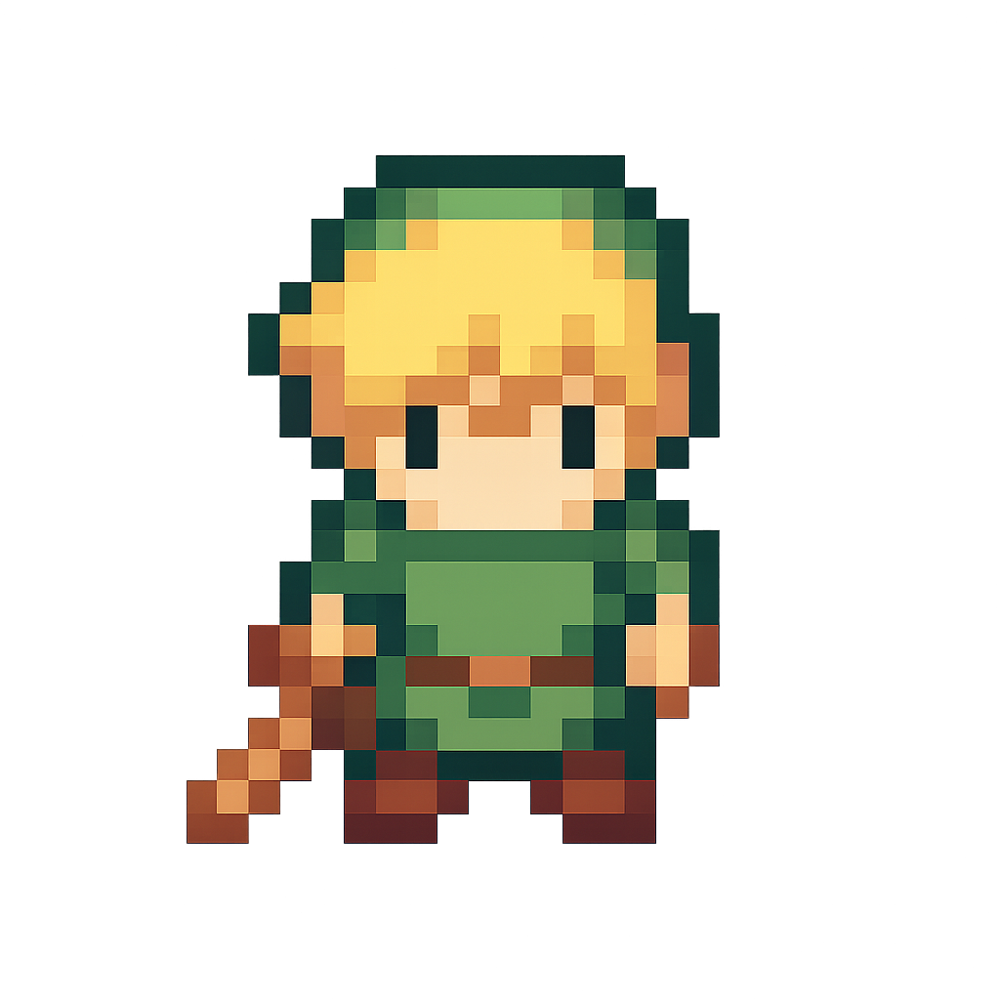
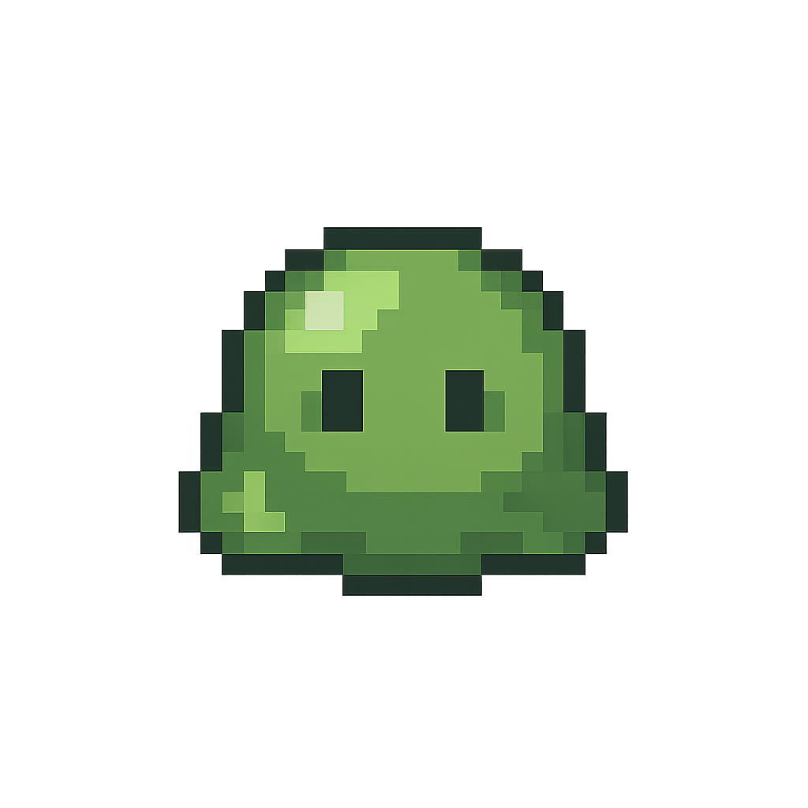
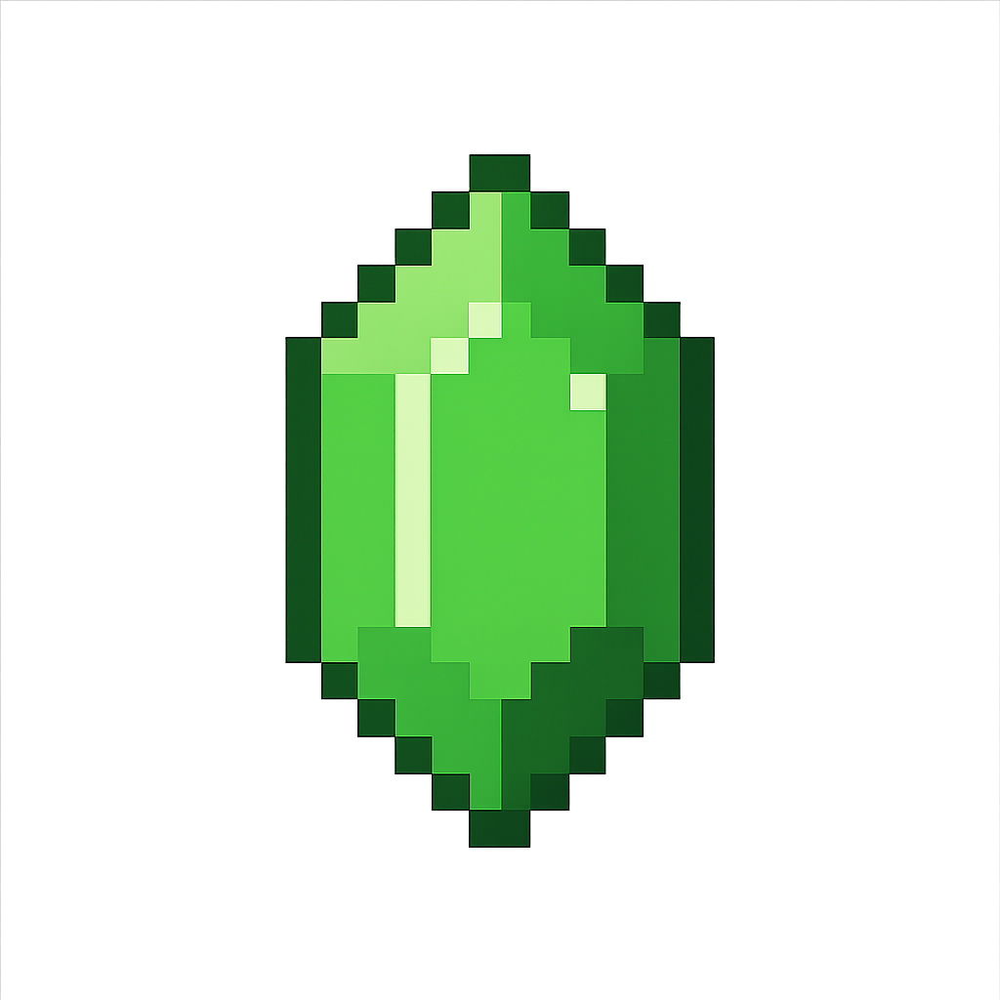
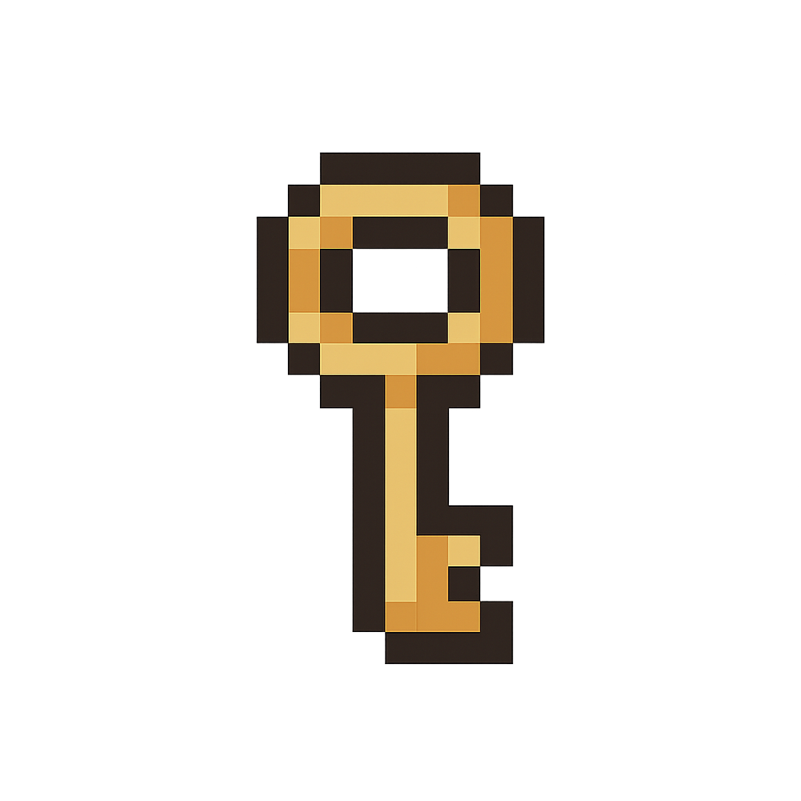
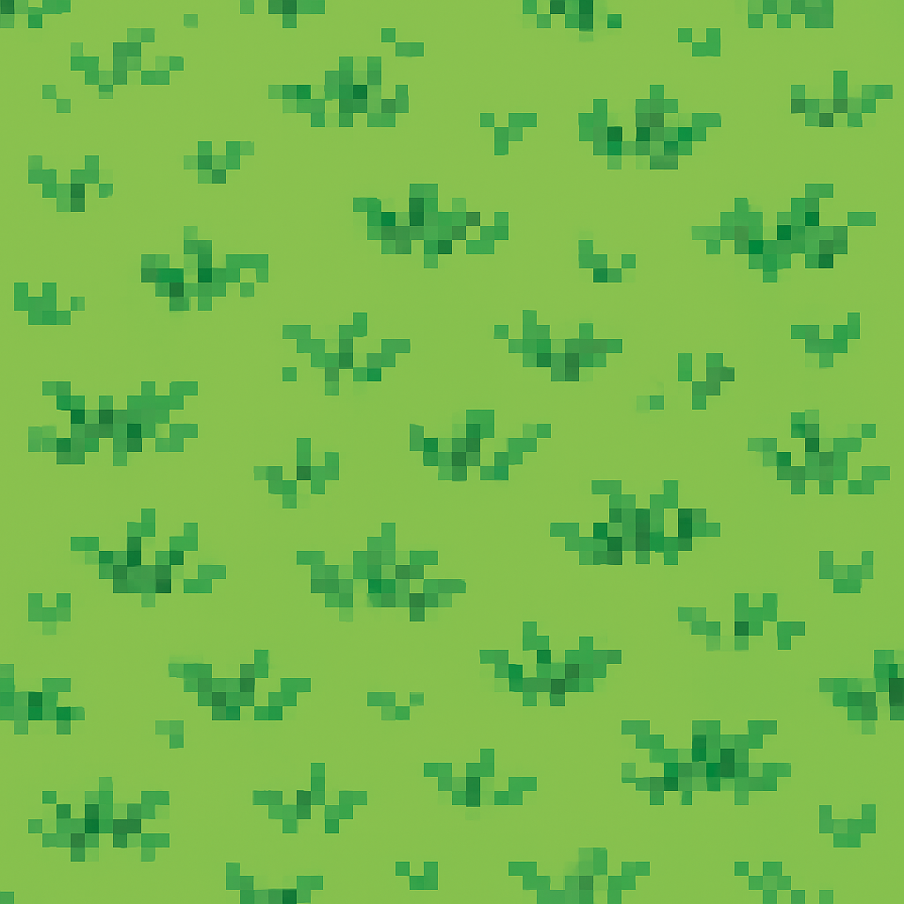
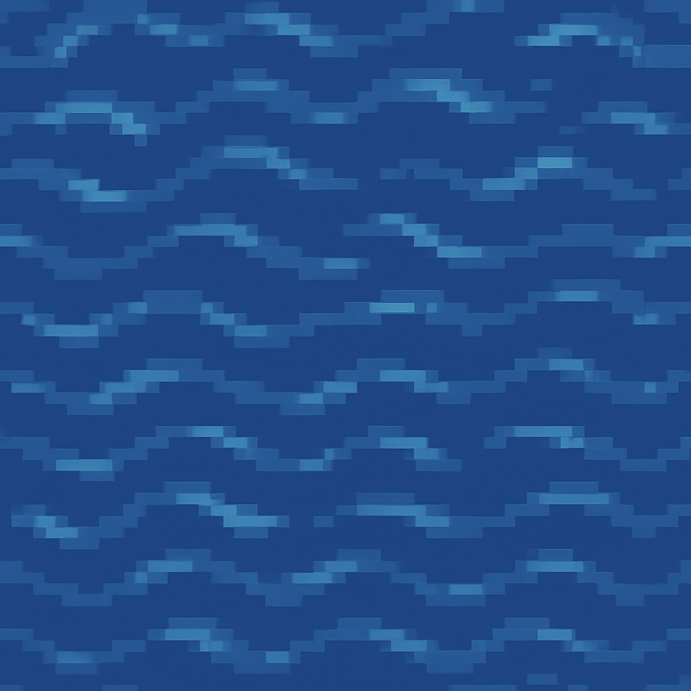
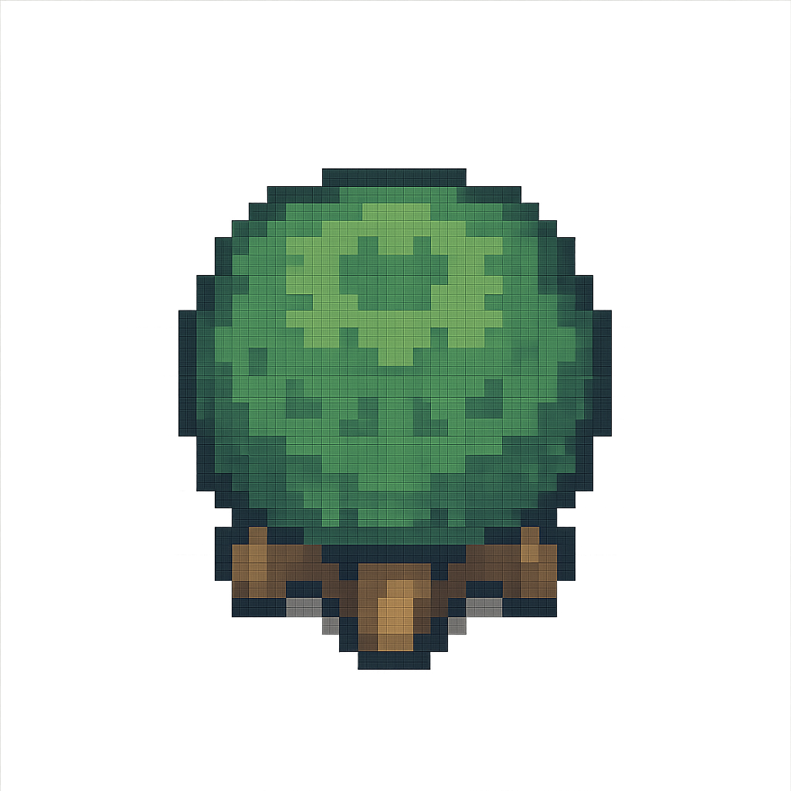
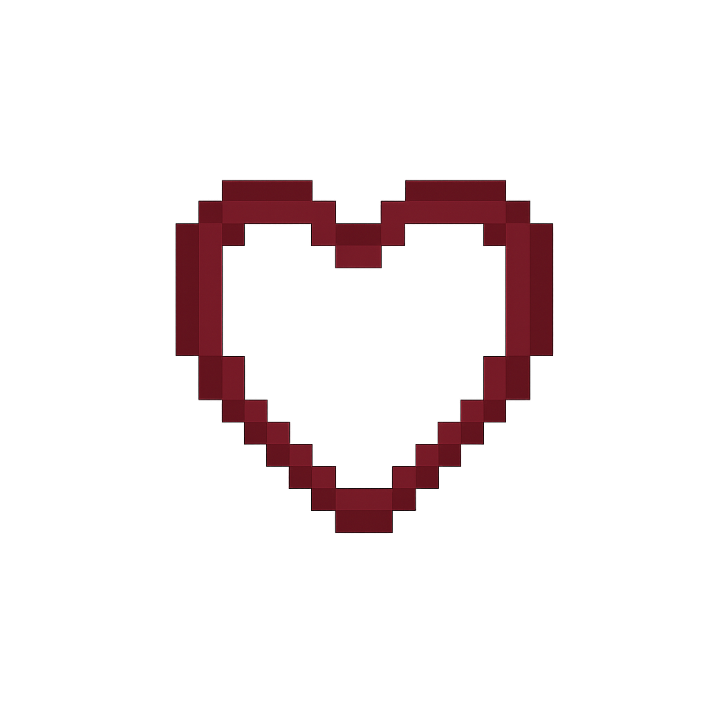

# Godot Image Gen MCP Server

An MCP (Model Context Protocol) server that generates game assets for Godot using OpenAI's `gpt-image-1` model. All generated assets are saved to a shared library with automatic cataloging, tagging, and cost tracking.

## Tools

| Tool | Description |
|------|-------------|
| `generate_sprite` | Character, enemy, and item sprites with transparent backgrounds |
| `generate_tileset` | Seamless tileable textures with multiple variations |
| `generate_ui_element` | Buttons, icons, health bars, and HUD elements |
| `generate_custom_image` | Full control over size, quality, style, and category |
| `search_asset_library` | Search existing assets by keyword, category, or tags |
| `get_library_stats` | Asset counts, cost breakdown, and recent generations |
| `get_total_cost` | Cumulative spending on image generations |

## Setup

```bash
# Clone and install
git clone https://github.com/yourusername/godot-image-gen.git
cd godot-image-gen
python3 -m venv venv
source venv/bin/activate
pip install -r requirements.txt

# Configure
cp .env.example .env
# Edit .env and add your OpenAI API key
```

## Claude Desktop Configuration

Open your Claude Desktop config file:

- **macOS:** `~/Library/Application Support/Claude/claude_desktop_config.json`
- **Windows:** `%APPDATA%\Claude\claude_desktop_config.json`
- **Linux:** `~/.config/Claude/claude_desktop_config.json`

Add the following to the `mcpServers` object:

```json
{
  "mcpServers": {
    "godot-image-gen": {
      "command": "/path/to/godot-image-gen/venv/bin/python",
      "args": ["/path/to/godot-image-gen/mcp_server.py"]
    }
  }
}
```

Replace `/path/to/godot-image-gen` with the actual path where you cloned the repo.

Restart Claude Desktop to load the new server.

## Asset Library Structure

Generated assets are automatically organized:

```
godot-assets/
├── sprites/
│   ├── characters/
│   ├── enemies/
│   └── items/
├── tiles/
├── ui/
├── backgrounds/
├── effects/
├── asset_index.json    # Searchable catalog
└── cost_log.json       # Cost tracking
```

## Example Output

All assets below were generated by this MCP server during a Zelda-like game project:

### Sprites
| Player | Enemy | Rupee | Heart | Key |
|--------|-------|-------|-------|-----|
|  |  |  |  |  |

### Tiles
| Grass | Water | Tree |
|-------|-------|------|
|  |  |  |

### UI Elements
| Heart Full | Heart Empty |
|------------|-------------|
|  |  |

## Cost Per Generation

| Quality | Cost |
|---------|------|
| Low | ~$0.01 |
| Medium | ~$0.04 |
| High | ~$0.17 |

## Requirements

- Python 3.8+
- OpenAI API key

## Disclaimer

This project is provided as-is with no warranty. It relies on the OpenAI API which incurs costs per image generation. You are responsible for monitoring your own API usage and costs. This is not an official Godot or OpenAI product.

## License

MIT
